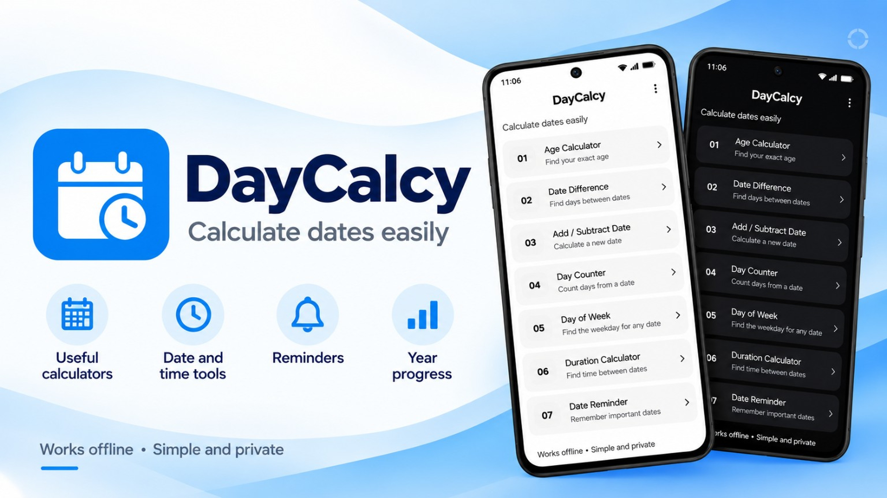

  

  
  
  

---

## What it does

You can work out someone's exact age, find the difference between two dates, add or subtract days, weeks, months or years, count days between dates (optionally skipping weekends and your own holidays), and check which weekday a date falls on.

There are also reminders for one-time or yearly dates, a calendar that shows them, a history of your last 100 calculations, a year progress view, home screen countdown widgets (2x2 and 4x2), and light, dark and system themes.

## Privacy

DayCalcy has no internet access, no accounts and no analytics. Everything you enter stays on your phone.

## Download

  
  

## License

DayCalcy is open source under GPL v3.0. See the [LICENSE](LICENSE) file for details.
